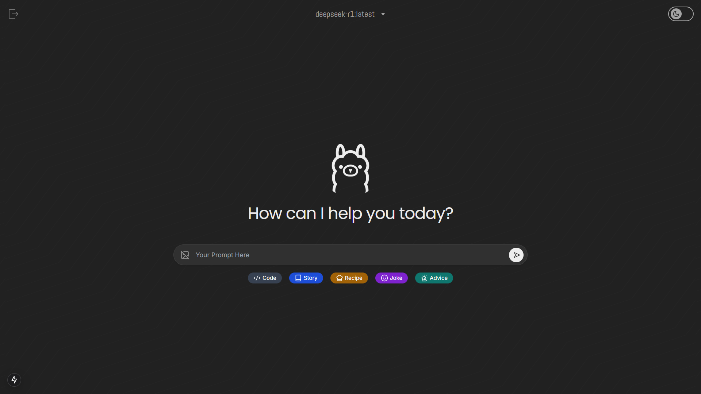
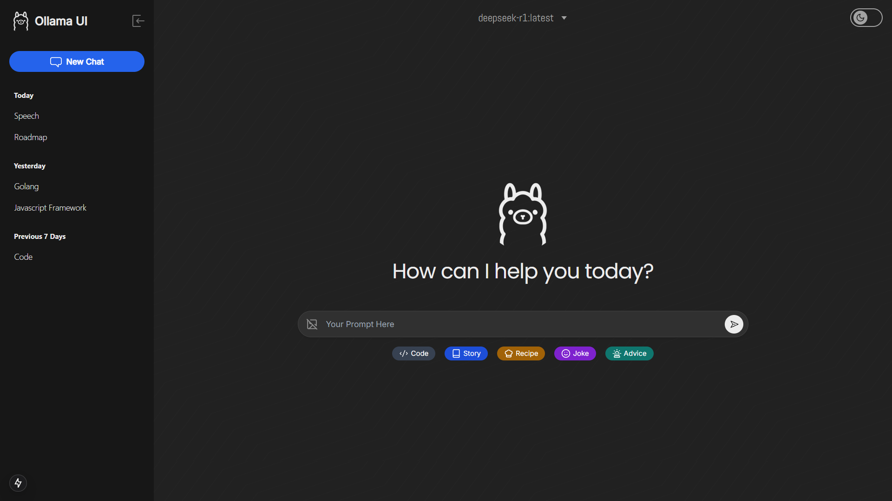
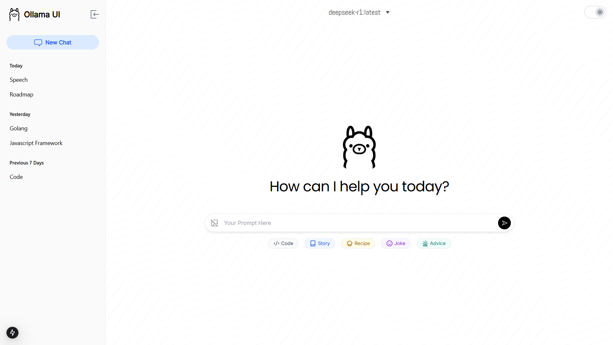

# Chat-Bot Ollama (Ollama UI)

---

A fun project integrating Ollama with Next.js to create a chatbot interface. This project demonstrates how to use Ollama's AI models and manage local data storage with IndexedDB.

## Features

---

* **Ollama Integration**: Communicates with Ollama AI models using the [Ollama.js](https://github.com/ollama/ollama-js) library.
* **IndexedDB Support**: Uses the [Dexie.js](https://dexie.org/) library for efficient local data storage.

* **Responsive UI**: Includes light and dark mode support.

## Screenshots

---

Here are some screenshots of the application:

### Dark Mode




### Light Mode



## Getting Started

---

### Prerequisites

1.**Download Ollama**

   Visit the [official Ollama website](https://ollama.com/) and download the application for your operating system.

2.**Pull an Ollama Model**

   After installing Ollama, open your terminal and pull a model using the following command:

```bash
ollama pull <model-name>
```

    Replace`<model-name>` with the name of the model you want to use (e.g., `llama2`).

### Installation

1. Clone the repository:

   ```bash
   git clone https://github.com/your-username/chat-bot-ollama.git
   cd chat-bot-ollama
   ```
2. Install dependedncies:
3. Start the development server:
4. Open the application in your browser at `http://localhost:3000`.

## Library Used

---

Some major library this project used:

* **[Ollama.js](https://github.com/ollama/ollama-js)** : A JavaScript library for interacting with Ollama's AI models.
* **[Dexie.js](https://dexie.org/)** : A wrapper library for IndexedDB, used for managing local data storage.
* **[Framer Motion](https://framermotion.framer.website/)** : A animation library

## Contributing

---

Contributions are welcome 😃! Feel free to open issues or submit pull requests.

## Todo

---

* Add pull and create new model feature
* Import and export chat history
* Logo Model
* Add toast scroll to bottom at message component

## Contributors

---

**Athaya Razan Zaidan** ( [razan4zaidan@gmail.com](vscode-file://vscode-app/c:/Users/razan/AppData/Local/Programs/Microsoft%20VS%20Code/resources/app/out/vs/code/electron-sandbox/workbench/workbench.html) )
